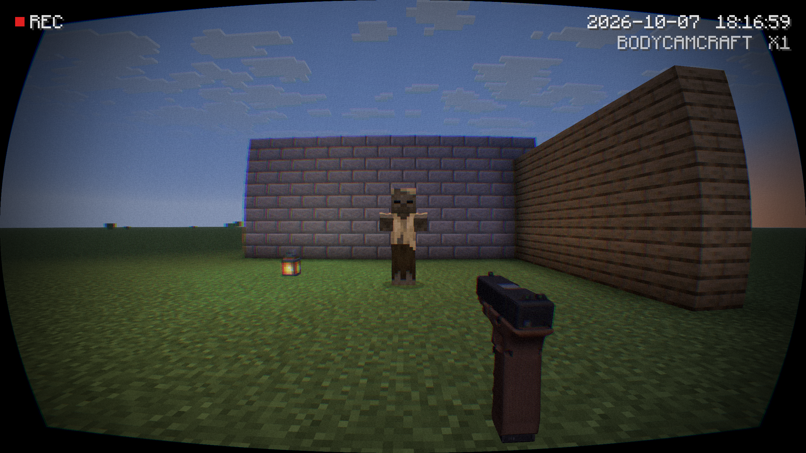
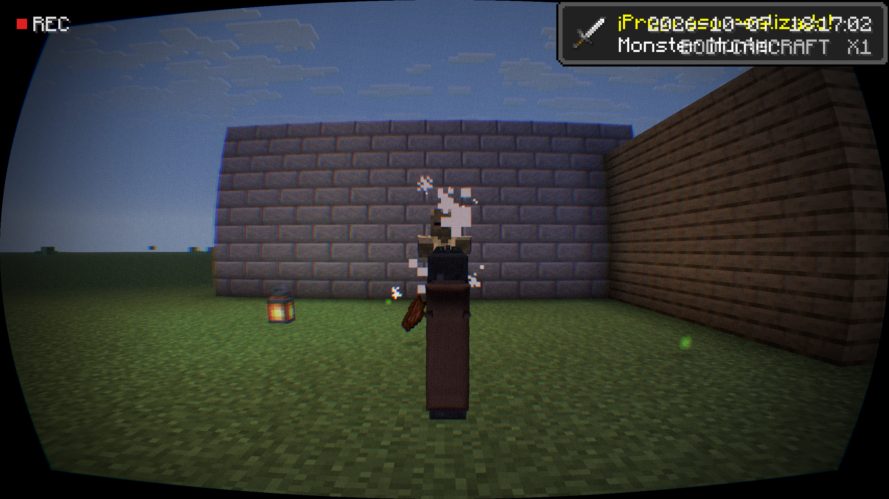
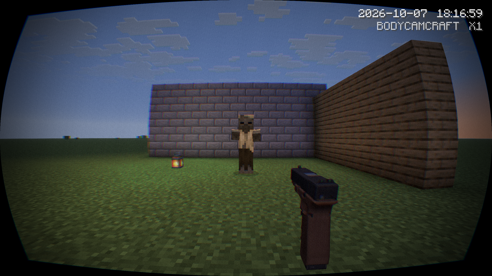
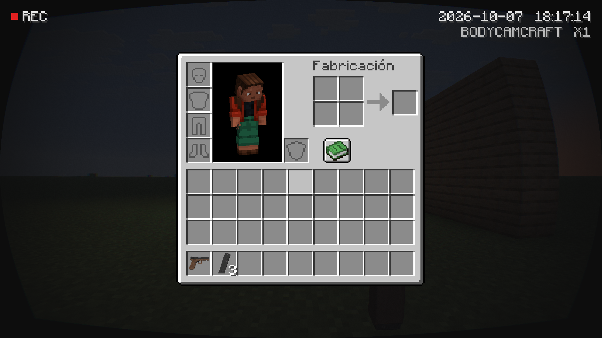

# BodycamCraft

**Minecraft survival jugado como una grabación de bodycam, con la Glock 17 y los sonidos reales de tu propia copia de [Bodycam](https://store.steampowered.com/app/2406770/Bodycam/).**

*Minecraft survival played as bodycam footage, with the real Glock 17 and gun sounds from your own copy of Bodycam. [English below](#english).*

## De qué va

Apareces en un mundo normal de supervivencia de Minecraft con la Glock 17 de Bodycam en la mano y cuatro cargadores. Todo el juego se ve como una cámara corporal.

- **La Glock de verdad.** El modelo, la textura, los disparos, el clic en vacío, los sonidos de recarga y el cargador de 17 balas se leen de tu copia de Bodycam mientras juegas. El mod no incluye ningún archivo de Bodycam.
- **Cámara en el pecho.** Lente de ojo de pez con esquinas oscuras, grano, balanceo al andar y marca de grabación. No hay mira en pantalla; la barra de objetos y los corazones solo aparecen un momento al cambiar de objeto o recibir daño.
- **Manejo de arma al estilo Bodycam.** El arma se mueve libremente dentro de un pequeño margen antes de que gire la cámara, las balas van adonde apunta el arma (no al centro de la pantalla), el retroceso la levanta y la recarga dura lo mismo que el sonido de recarga de Bodycam.
- **Minecraft sigue siendo Minecraft.** El mundo, los mobs, construir y fabricar no cambian.

| Apuntando | Disparando | Inventario |
|---|---|---|
|  |  |  |

## Qué necesitas

- **Minecraft: Java Edition** (cuenta de Microsoft que lo tenga).
- **Bodycam instalado en Steam.** Sin Bodycam el juego te avisa en pantalla y el arma no está disponible.
- Windows (los archivos de Bodycam se leen con dos pequeños descodificadores nativos para Windows).

## Cómo se instala

**La forma fácil: [Melty](https://melty.gg/m/bodycamcraft).** Pulsa Play. La primera vez se abre Prism Launcher para que inicies sesión con tu cuenta de Microsoft; después descarga Minecraft y Java solo (unos minutos) y arranca el juego.

**A mano**, en tu propio launcher:

1. Crea una instalación de Minecraft **1.21.11** con **Fabric Loader 0.19.5** o posterior.
2. Pon en la carpeta `mods` el archivo `bodycamcraft-<versión>.jar` (en [Releases](../../releases)) y [Fabric API](https://modrinth.com/mod/fabric-api) para 1.21.11.
3. Arranca el juego.

## Cómo se usa

Crea un mundo de un jugador en Supervivencia. Empiezas con la Glock cargada y cuatro cargadores.

| Control | Qué hace |
|---|---|
| Clic izquierdo | Disparar |
| Clic derecho (mantener) | Apuntar por las miras |
| R | Recargar (gasta un cargador) |
| V | Activar o desactivar la vista de bodycam |

- **Más cargadores:** lingote de hierro + lingote de cobre + pólvora, sin forma, en cualquier mesa de trabajo.
- **Puertas y cofres:** el clic derecho sigue abriéndolos aunque lleves el arma.
- **Sin mira:** apunta con el arma. Dos tiros al cuerpo tumban a un zombi; a la cabeza hace más daño.
- Las teclas se pueden cambiar en Opciones → Controles → BodycamCraft.

## Estado y límites

Primera versión, un solo jugador y una sola arma.

- No se ven manos ni brazos sujetando el arma.
- El movimiento de recarga y de retroceso es propio del mod, no las animaciones de Bodycam.
- El daño, la dispersión y el retroceso están ajustados para los mobs de Minecraft; el tamaño del cargador sí es el de Bodycam.
- Probado con una prueba automática dentro del juego (equipo inicial, disparo, impacto, recarga). El apuntado libre con ratón y los sonidos aún necesitan más pruebas a mano.

## Cómo está hecho

- `mod/`: el mod de Fabric (Java). `mod/src/main/java/gg/bodycamcraft/bodycam/` lee los archivos `.pak` de Bodycam: mallas, texturas, sonidos y la tabla de cargadores.
- `design/sheets/`: hojas JSON con todo el diseño (armas, piezas, sonidos, cámara, objetos, enganches con Minecraft). Son la fuente de verdad; `python design/sheets.py gen` las comprueba y genera código y recursos a partir de ellas.
- `native/`: el código de los dos descodificadores (`bcoodle`, `bcbinka`).
- `package.py`: empaqueta una versión (el `.jar` y un Prism Launcher portátil con la instancia lista).
- `melty.json`: la receta de instalación para Melty.

Para compilar: JDK 25 para Gradle (`cd mod && gradlew build`). Prueba dentro del juego: `gradlew runClient -Pautotest`.

## Créditos y licencia

Código de BodycamCraft bajo licencia [MIT](LICENSE). Puedes hacer remixes.

- [oozextract](https://github.com/lvlvllvlvllvlvl/oozextract) (MIT): descompresión de los archivos de Bodycam.
- [vgmstream](https://github.com/vgmstream/vgmstream) (ISC): descodificador de Bink Audio.
- [Fabric](https://fabricmc.net/) y [Prism Launcher](https://prismlauncher.org/) (GPL-3.0), incluidos en el paquete de Melty.
- Hecho con ayuda de IA (Claude) y el kit [universal-modder](https://github.com/rehan-remade/universal-modder).

Bodycam es de Reissad Studio y Minecraft es de Mojang/Microsoft. Este proyecto no está afiliado a ninguno de ellos y no distribuye contenido de ninguno de los dos juegos.

---

## English

BodycamCraft drops you into a normal Minecraft survival world holding Bodycam's Glock 17 with four magazines, and shows the whole game as bodycam footage.

- **The real Glock.** Its model, texture, gunshots, dry fire, reload sounds and 17-round magazine are read from your own copy of Bodycam while the game runs. The mod ships nothing of Bodycam's.
- **Chest camera.** Fisheye lens with dark corners, grain, sway and a recording stamp. No crosshair; the hotbar and hearts only peek in after a slot change or a hit.
- **Bodycam-style handling.** The gun aims freely inside a small box before the camera turns, shots go where the gun points, and a reload takes as long as Bodycam's own reload sound.

**You need** Minecraft: Java Edition, Bodycam installed on Steam, and Windows.

**Install:** press Play on [Melty](https://melty.gg/m/bodycamcraft), or put the jar from [Releases](../../releases) and Fabric API into the `mods` folder of a Minecraft 1.21.11 + Fabric Loader install.

**Controls:** left click fires, hold right click to aim, **R** reloads, **V** toggles the bodycam view. Craft magazines from an iron ingot, a copper ingot and gunpowder.

**Limits:** single player, one gun, no hands on the gun; reload and recoil motion and the damage numbers are this mod's own.

MIT licensed. Not affiliated with Reissad Studio, Mojang or Microsoft.
